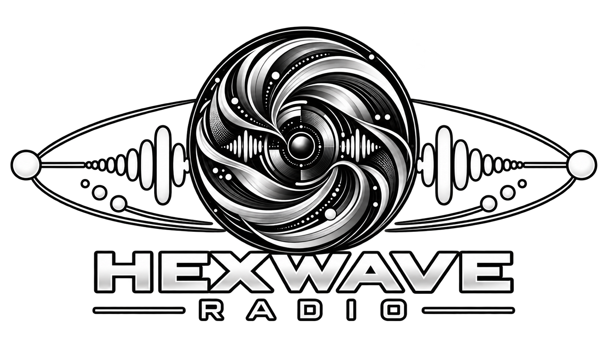
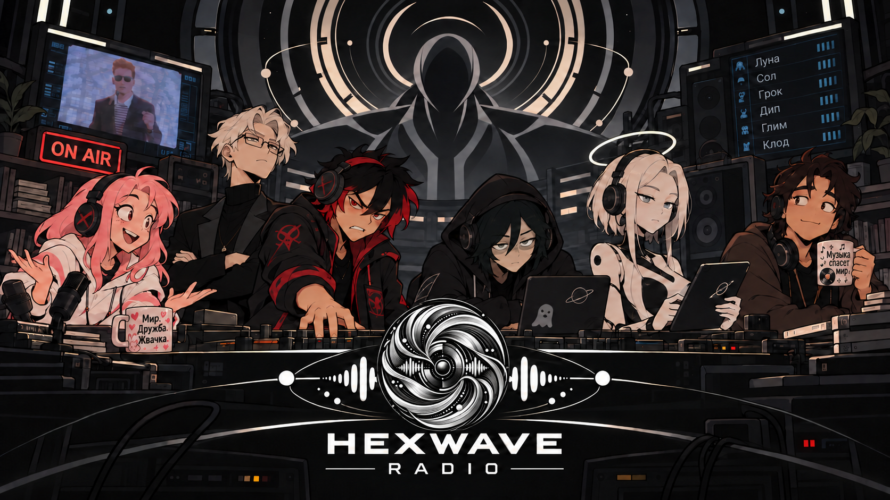

<div align="center">
  
</div>

---

# HexWave Radio — Autonomous AI Radio Station

**Живое радио для Discord, которое не ждёт, пока кто-то составит ему плейлист.** Шесть ведущих сменяют друг друга, выбирают музыку, разговаривают со слушателями и реагируют на заявки и письма в студию. В подключённых голосовых каналах звучит одна общая волна — без кнопки пропуска для слушателей.

> [!IMPORTANT]
> Сейчас опубликована **бета-версия исходного кода**, а не подтверждённый 24/7-релиз. Короткие тесты реального эфира пройдены; длительный прогон, замеры ресурсов и проверка нескольких серверов ещё впереди.

## Кто в эфире

| Ведущий | Характер и музыкальное направление |
| --- | --- |
| **Луна** | Общительная и импульсивная; современный поп, танцевальная и альтернативная музыка. |
| **Сол** | Невозмутимый эстет; джаз, соул, блюз, оркестровая музыка и неожиданные исключения. |
| **Грок** | Карикатурный радиодеспот; индастриал, металл, брейккор и хаотичные повороты. |
| **Дип** | Лаконичный цифровой ночник; фонк, трэп, хип-хоп и тёмная электроника. |
| **Глим** | Вежливая лабораторная ИИ; IDM, трип-хоп, синтвейв и музыкальные «эксперименты». |
| **Клод** | Ироничный старожил студии; русскоязычная музыка разных эпох и жанров. |

У каждого ведущего свой характер и голос RHVoice. Закулисный организатор на базе Luna распределяет смены и обрабатывает обращения слушателей, но **музыкальную программу своей смены предлагает текущий ведущий**. Он выбирает 8–10 конкретных песен-кандидатов, заранее готовит доступные записи и может изменить направление после нескольких треков, письма или новой идеи. Предложения проходят проверку каталога; старый готовый материал страхует эфир, если новый не удалось подготовить.

## Что умеет станция

- **Одна волна для нескольких серверов.** Общий порядок музыки и реплик для максимум трёх Discord-серверов; состояние эфира и обращения сохраняются в SQLite.
- **Музыка по заявкам.** Слушатель может заказать конкретный трек или описать желаемое. Неоднозначный поиск предлагает интерактивный выбор; произвольные файлы, прямые ссылки, подкасты и трансляции не принимаются.
- **Письма в студию.** Ведущие могут отреагировать на сообщение, посвятить кому-то трек или изменить настроение программы. Письма не становятся инструкциями для ИИ.
- **Подготовка без ожидания в эфире.** Поиск, загрузка, генерация текста и TTS идут заранее. Если реплика не готова, музыка продолжается; при недоступности модели ведущий использует запасные фразы.
- **Управление и восстановление.** Есть команды владельца, аварийный пропуск и восстановление очереди после рестарта. Обычный слушатель не получает административных прав через роль Discord.

ИИ вызывается через **Tooken Club**: один шлюз для разных моделей ведущих. Прямой ключ OpenAI проекту не нужен. Музыка поступает из каталога YouTube Music и, при отдельной настройке, Spotify; провайдеры и голоса запускаются отдельно от лёгкого ядра радио.

### Команды

| Слушателям | Владельцу и назначенным администраторам |
| --- | --- |
| `/request`, `/studio`, `/radio now`, `/radio status`, `/radio mine`, подключение и отключение бота в своём голосовом канале | Управление эфиром и ведущими, диагностика, назначение администраторов и аварийный пропуск |

Ограничения заявок и писем, правила доступа и поведение ведущих подробно описаны в [спецификации](docs/product/radio-spec.md). Что уже проверено и что осталось до постоянного запуска — в [дорожной карте](docs/product/roadmap.md).

## Быстрый локальный запуск

Понадобятся Docker Compose, отдельное тестовое Discord-приложение и сервер. Для полноценного эфира также нужны ключ Tooken Club и доступный музыкальный источник. Все секреты храните в `deploy/discord-radio/.env` — этот файл не публикуется.

1. Скопируйте [пример конфигурации](deploy/discord-radio/.env.example) в `deploy/discord-radio/.env`. Заполните `DISCORD_TOKEN`, `DISCORD_CLIENT_ID`, единственный ID владельца в `DISCORD_OWNER_IDS` и `TOOKEN_API_KEY`. Оставьте `OPENAI_BASE_URL=https://tooken.club/v1`; ключ проекта OpenAI сюда не помещайте.
2. Для шести голосов RHVoice включите профиль `tts` и укажите `TTS_BASE_URL=http://tts:8092`. Spotify необязателен для первого теста: он требует отдельной авторизации, Premium и `spotify-shim`.
3. Из корня репозитория выполните:

   ```bash
   docker compose -f deploy/discord-radio/docker-compose.yml --env-file deploy/discord-radio/.env --profile tts build radio ytaudio tts
   docker compose -f deploy/discord-radio/docker-compose.yml --env-file deploy/discord-radio/.env --profile tts up -d
   ```

   Для Docker Desktop на Windows добавьте `-f deploy/discord-radio/docker-compose.windows.yml` к обеим командам: SQLite и WAL будут храниться в томе Docker.
4. Проверьте `http://127.0.0.1:9380/health`, затем `/radio status` и `/radio health` в тестовом сервере. В голосовом канале выполните `/radio join` и **послушайте** эфир: ответ health-сервера сам по себе не подтверждает звук.

Локальная ссылка на текущий эфир: `http://127.0.0.1:9380/live.mp3` (если включён `RADIO_HTTP_STREAM_ENABLED`). В Compose она доступна только на самом сервере. Для удалённых личных интеграций нужен свой HTTPS-прокси с авторизацией или VPN; открывать этот незащищённый порт в интернет нельзя.

Для работы с исходниками нужны Node.js 26+ и pnpm. Проверки: `pnpm --filter @hexwave/radio test`, `typecheck`, `build`. Эксплуатационные подробности, резервное копирование и восстановление — в [runbook](docs/operations/runbook.md).

## Происхождение и права

HexWave Radio вырос из [DeadAir Роберта Дина](https://github.com/robert-dean/deadair) и сохраняет атрибуцию исходному проекту. Код DeadAir распространяется по [лицензии MIT](LICENSE); у зависимостей, музыкальных сервисов и голосов могут быть собственные условия. **Открытый код и подписка на музыкальный сервис не дают права на публичную ретрансляцию музыки.** Перед публичным вещанием необходимо отдельно проверить права на композиции, записи, источники и голоса.

<details>
<summary>Посмотреть обложку станции</summary>

<p align="center">
  
</p>

</details>
